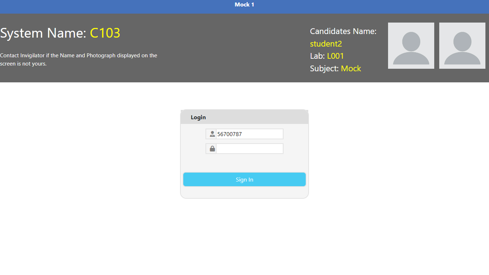

# nQuest is an open source html, js, css based assessment solution

### Supported questions:

<table>
    <th>Qtype</th>
    <tr>Single Correct MCQ</tr>
    <tr>Multi Correct MCQ</tr>
    <tr>Integer type answer</tr>
</table>

### Screenshots

#### login Image

#### SMCQ Type 

#### MMCQ Type

#### Integer Type

##### Feel free to fork repo to make changes